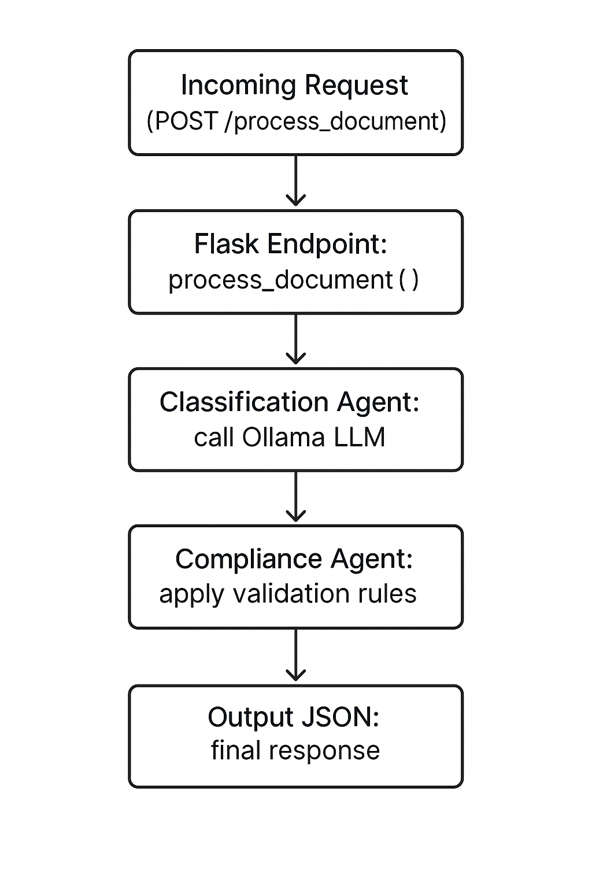

# Alix Estate Document Agent‐Based System

A lightweight Flask API that classifies and validates estate‐related documents (Death Certificates, Wills/Trusts, Property Deeds, Financial Statements, Tax Documents, Miscellaneous) using a local Ollama 3.2 LLM.

---

## Features

- **Master Router**: Receives an uploaded document, delegates to Classification → Compliance agents.  
- **Classification Agent**: Maps text to one of six estate categories.  
- **Compliance Agent**: Enforces category-specific validation rules.  

---

## Prerequisites

- **Python 3.8+**  
- **Ollama CLI** (for local LLM inference)  
- (Optional) `virtualenv` or `venv` for isolation  

---

## Installing Ollama & Model

1. **Download Ollama CLI**  
   [https://ollama.com/download](https://ollama.com/download)  
2. **Verify installation**  
   ```bash
   ollama version
   ollama pull llama3.2
   ollama run llama3.2

Leave this running while you use the API.


3. Clone the repo
  ```bash
  git clone https://github.com/DexterCooke/Alix.git
  cd Alix/api
  ```


4. Create & activate a venv
  ```bash
python3 -m venv .venv
source .venv/bin/activate    # macOS/Linux
> .venv\Scripts\activate     # Windows
````

5. Install Python dependencies
  ```bash
pip install -r requirements.txt
````

6. ensure your venv is active and Ollama is running
  ```bash
cd Alix/api
export FLASK_APP=app.py
python -m flask run
```

The API listens on ```http://127.0.0.1:5000```


## Copy curl examples in Alix/documents to validate documents or use Postman
- death_cert_curl.txt
- false_death_cert_curl.txt
- financial_statement_curl.txt
- miscellaneous_curl.txt
- property_deed_curl.txt
- tax_doc_curl.txt
- will_curl.txt


## Postman
New POST → http://127.0.0.1:5000/process_document

Headers → Content-Type: application/json

Body → raw → JSON:

{
  "documentId": "doc-will",
  "text": "Last Will and Testament of Jane Doe...\nSigned: Jane Doe\nDate: April 1, 2023"
}

Click Send, inspect the JSON response.





